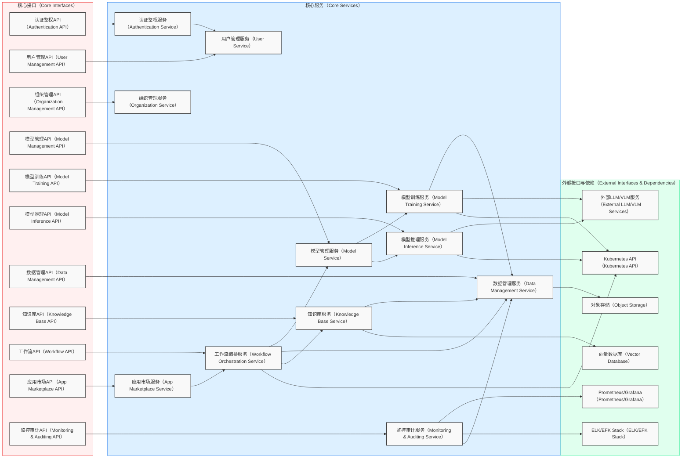

# `xai-workbench` 项目总体架构设计

## 1. 引言（Introduction）

`xai-workbench` 旨在为企业客户提供一个安全、可控、低门槛的专属AI工作台，以应对AIGC应用落地中的人才短缺、数据安全和模型演进不足等核心挑战。本项目通过集成通用生成式AI能力、预置行业场景模板，并提供低代码/无代码定制工具，赋能企业用户快速构建、部署和优化AI应用，实现业务效率提升与创新。

本文档将详细阐述 `xai-workbench` 的总体架构设计、核心模块划分、技术选型以及未来代码实现的蓝图，以指导项目的开发与演进。

## 2. 核心架构原则（Core Architectural Principles）

`xai-workbench` 的架构设计遵循以下核心原则，旨在构建一个高性能、高可用、安全且易于扩展和维护的系统：

1.  **分层与模块化设计（Layered & Modular Design）**:
    *   **展现层（Presentation Layer）**: 负责用户交互与应用界面，将业务逻辑与用户界面分离。
    *   **应用层（Application Layer）**: 协调领域层和基础设施层，处理业务用例，不包含核心业务逻辑。
    *   **领域层（Domain Layer）**: 封装核心业务逻辑、实体、值对象、聚合根、领域服务和仓储接口定义。
    *   **基础设施层（Infrastructure Layer）**: 提供技术实现细节，如数据库访问、消息队列、文件存储、外部API集成等。
    *   **模块间高内聚、低耦合**: 通过清晰的接口定义和依赖反转原则，确保各模块独立开发、测试和部署。

2.  **借鉴与创新（Leverage & Innovate）**:
    *   深入分析现有开源项目（如Kubeflow Pipelines、MLflow、Haystack、Triton Inference Server、Node-RED等），吸收其在工作流编排、模型管理、RAG、推理服务、可视化构建等方面的优秀实践。
    *   在此基础上进行创新，例如引入自然语言描述生成工作流、企业私有化模型沙箱、增量微调与反馈闭环机制。

3.  **端到端价值导向（End-to-End Value-Driven）**:
    *   所有技术设计决策都紧密围绕最终用户价值和解决的企业痛点。
    *   通过清晰的接口、数据结构和交互流程，将产品功能需求直接转化为可实现的技术方案。

4.  **可测试性（Testability）**:
    *   采用接口编程（Interface-Oriented Programming）和依赖注入，确保各组件易于独立单元测试和集成测试。
    *   遵循测试驱动开发（TDD）思想，为核心功能编写测试用例。

5.  **可观测性（Observability）**:
    *   统一的日志系统（`logger`），支持结构化日志，方便问题追溯。
    *   全面的指标（Metrics）采集（通过Prometheus/Grafana），实时监控系统健康状况和性能。
    *   分布式追踪（Tracing，通过OpenTelemetry），可视化请求生命周期，定位性能瓶颈和错误。

6.  **可靠性与容错性（Reliability & Fault Tolerance）**:
    *   集中的错误管理机制，统一错误码和错误信息。
    *   服务间通信采用熔断、限流、重试等机制，提高系统韧性。
    *   数据备份、恢复和异地多活部署策略。

7.  **高性能与可伸缩性（High Performance & Scalability）**:
    *   微服务架构，支持按需水平扩展。
    *   无状态服务设计，便于容器化部署和弹性伸缩。
    *   高效的模型推理服务，支持GPU加速、动态批处理和模型缓存。

8.  **安全性（Security）**:
    *   贯穿整个设计与开发周期的安全考量（Security by Design）。
    *   严格的身份认证（Authentication）与授权（Authorization）。
    *   数据加密（传输中和存储中）和脱敏。
    *   内容安全审计与风险过滤。
    *   安全沙箱环境隔离。

9.  **代码质量与可维护性（Code Quality & Maintainability）**:
    *   遵循Go语言官方最佳实践和Clean Code原则。
    *   清晰的命名约定、一致的代码风格和完善的注释（中英文双语）。
    *   集中定义常量、枚举类型和错误。

## 3. 高层架构概览（High-Level Architecture Overview）

`xai-workbench` 采用微服务架构，基于Kubernetes进行部署和管理。整个系统逻辑上分为以下几个核心层：用户交互与应用层、平台服务层、AI模型层和基础设施层。

```mermaid
graph TD
    %% 图例（Legend）
    subgraph LEGEND[图例（Legend）]
        direction LR
        L_USER[用户（User）]
        L_PLATFORM[平台层（Platform Layer）]
        L_MODEL[模型层（Model Layer）]
        L_INFRA[基础设施（Infrastructure）]
    end
    style LEGEND fill:#ECECEC,stroke:#333

    subgraph UI_Layer[用户交互与应用层（UI & Application Layer）]
        direction LR
        A_Market[AI应用市场（AI App Marketplace）<br/>营销、客服、运营等模板]
        A_Builder[低代码AI应用构建器（Low-Code AI App Builder）]
        U_Portal[用户门户与管理后台（User Portal & Admin）]
    end

    subgraph Platform_Service_Layer[平台服务层（Platform Service Layer）]
        direction TB
        PS_Orchestration[AI服务编排（AI Service Orchestration）]
        PS_DataMgmt[数据管理与安全沙箱（Data Management & Secure Sandbox）]
        PS_Knowledge[知识库接入与增强（Knowledge Base Ingestion & RAG）]
        PS_Monitoring[监控与审计（Monitoring & Auditing）]
        PS_Auth[认证与授权（Authentication & Authorization）] 
        %% 增加认证与授权
    end

    subgraph Model_Layer[AI模型层（AI Model Layer）]
        direction TB
        ML_Foundation[通用基础大模型（Foundation LLMs/VLMs）<br/>（自研/合作/开源）]
        ML_Finetuned[企业客户场景微调模型（Scene Fine-tuned Models）]
        ML_Custom[用户定制模型（User-Customized Models）]
        ML_Training[模型训练服务（Model Training Service）] 
        %% 增加训练服务
        ML_Inference[模型推理服务（Model Inference Service）] 
        %% 增加推理服务
    end

    subgraph Infra_Layer[基础设施层（Infrastructure Layer）]
        direction LR
        Infra_Compute[AI算力资源池（AI Compute Pool）<br/>（公有云/私有云/深信服云）]
        Infra_Storage[数据存储（Data Storage）<br/>（RDB/Object/Vector）]
        Infra_MQ[消息队列（Message Queue）<br/>（Kafka/RabbitMQ）]
        Infra_K8S[容器编排（Container Orchestration）<br/>（Kubernetes）]
        Infra_LogMon[日志与监控（Logging & Monitoring）<br/>（ELK/Prometheus/Grafana）]
    end

    UI_Layer --> PS_Auth
    UI_Layer --> PS_Orchestration
    PS_Auth --> PS_Orchestration
    PS_Orchestration --> ML_Inference
    PS_Orchestration --> ML_Training
    PS_DataMgmt -.-> ML_Training
    PS_DataMgmt -.-> ML_Inference
    PS_Knowledge -.-> ML_Inference 
    %% RAG需要查询知识库
    PS_Monitoring -.-> Infra_LogMon

    ML_Foundation --> ML_Inference
    ML_Finetuned --> ML_Inference
    ML_Custom --> ML_Inference
    ML_Training --> ML_Finetuned
    ML_Training --> ML_Custom

    ML_Training --> Infra_Compute
    ML_Inference --> Infra_Compute
    Infra_Compute --> Infra_Storage
    Infra_Compute --> Infra_MQ
    Infra_K8S --> Infra_Compute
    Infra_K8S --> Infra_Storage
    Infra_K8S --> Infra_MQ
    Infra_K8S --> Infra_LogMon

    classDef default fill:#f9f9f9,stroke:#333,stroke-width:1.5px;
    classDef platform fill:#DDF0FF,stroke:#3A8BEF;
    classDef model fill:#FFF0DD,stroke:#EF9C3A;
    classDef infra fill:#E0FFEE,stroke:#3AEF9C;
    classDef ui fill:#FFEEF0,stroke:#EF3A9C;
    class UI_Layer ui;
    class Platform_Service_Layer platform;
    class Model_Layer model;
    class Infra_Layer infra;
````

**架构解读**：

1. **用户交互与应用层（UI & Application Layer）**：

   * **AI应用市场（AI App Marketplace）**: 提供预置的行业/场景AI应用模板，用户可一键部署。
   * **低代码AI应用构建器（Low-Code AI App Builder）**: 可视化拖拽界面，用户通过组件组合和流程定义构建定制化AI应用。
   * **用户门户与管理后台（User Portal & Admin）**: 用户认证、权限管理、模型微调记录、API Key管理、计费等入口。

2. **平台服务层（Platform Service Layer）**：

   * **AI服务编排（AI Service Orchestration）**: 核心调度引擎，负责解析低代码配置、触发模型推理/训练任务、协调各微服务间的调用，如基于Argo Workflows或自研的状态机引擎。
   * **数据管理与安全沙箱（Data Management & Secure Sandbox）**: 管理用户上传的企业数据，提供数据脱敏、加密存储、版本管理，并在隔离环境中进行数据处理和微调。
   * **知识库接入与增强（Knowledge Base Ingestion & RAG）**: 支持企业文档（如产品手册、SOP、销售话术）的导入、索引（ES/Vector DB）和检索，并通过RAG模型增强生成效果。
   * **监控与审计（Monitoring & Auditing）**: 对所有系统操作、模型调用、数据访问进行实时监控、日志记录和审计，确保合规性和可追溯性。
   * **认证与授权（Authentication & Authorization）**: 负责用户身份验证（OAuth2/JWT）、角色管理和细粒度的权限控制。

3. **AI模型层（AI Model Layer）**：

   * **通用基础大模型（Foundation LLMs/VLMs）**: 集成自研、开源或合作的通用基础大模型，作为微调和RAG的基础。
   * **企业客户场景微调模型（Scene Fine-tuned Models）**: 针对特定行业和业务场景预训练或微调的模型。
   * **用户定制模型（User-Customized Models）**: 用户通过平台进行增量微调生成的专属模型。
   * **模型训练服务（Model Training Service）**: 提供模型微调、增量学习、实验管理等功能，可能基于Kubeflow/MLflow。
   * **模型推理服务（Model Inference Service）**: 提供高并发、低延迟的模型推理能力，支持多模型、多框架（基于Triton Inference Server/Ray Serve）。

4. **基础设施层（Infrastructure Layer）**：

   * **AI算力资源池（AI Compute Pool）**: GPU/TPU加速的计算集群，支持公有云、私有云或混合云部署。
   * **数据存储（Data Storage）**: 关系型数据库（PostgreSQL/MySQL）用于元数据和业务数据，对象存储（S3/Ceph）用于原始数据和模型权重，向量数据库（Qdrant/Milvus）用于知识库向量索引。
   * **消息队列（Message Queue）**: 用于异步任务处理、事件通知和削峰填谷。
   * **容器编排（Container Orchestration）**: Kubernetes作为核心运行时环境，管理服务的部署、扩缩容和自愈。
   * **日志与监控（Logging & Monitoring）**: ELK/EFK Stack用于日志收集和分析，Prometheus/Grafana用于指标监控和告警。

## 4. 核心系统模块设计（Core System Module Design）

基于上述高层架构，我们将进一步细化核心模块的设计，并突出其职责和交互。

### 4.1. 领域模型（Domain Models）

领域模型是系统核心业务概念的抽象，定义了数据结构和行为。

```mermaid
classDiagram
    direction LR
    class User {
        +ID string
        +Username string
        +Email string
        +Roles []string
        +OrganizationID string
        +CreatedAt time.Time
        +UpdatedAt time.Time
    }

    class Organization {
        +ID string
        +Name string
        +Quota Quota
        +Status string
        +CreatedAt time.Time
        +UpdatedAt time.Time
    }

    class Quota {
        -MaxModels int
        -MaxStorageGB int
        -ComputeHours int
    }

    class Model {
        +ID string
        +Name string
        +Description string
        +Type ModelType
        +Version string
        +Status ModelStatus
        +BaseModelID string
        +FineTuningConfig FineTuningConfig
        +DeployedEndpoint string
        +CreatedAt time.Time
        +UpdatedAt time.Time
    }

    class ModelType {
        <<Enumeration>>
        LLM
        VLM
        Speech
        Custom
    }

    class ModelStatus {
        <<Enumeration>>
Training
        Deployed
        Offline
    }

    class FineTuningConfig {
        -DatasetID string
        -Parameters map[string]string
        -Strategy FineTuningStrategy
    }

    class FineTuningStrategy {
        <<Enumeration>>
        LoRA
        PEFT
        Full
    }

    class Dataset {
        +ID string
        +Name string
        +Description string
        +SourceType DataSourceType
        +StoragePath string
        +IsSensitive bool
        +Status DatasetStatus
        +CreatedAt time.Time
        +UpdatedAt time.Time
    }

    class DataSourceType {
        <<Enumeration>>
        Upload
        API
        Database
        KnowledgeBase
    }

    class DatasetStatus {
        <<Enumeration>>
        Pending
        Processing
        Ready
        Failed
    }

    class Workflow {
        +ID string
        +Name string
        +Description string
        +Definition WorkflowDefinition
        +Status WorkflowStatus
        +CreatedBy string
        +OrganizationID string
        +CreatedAt time.Time
        +UpdatedAt time.Time
    }

    class WorkflowDefinition {
        -Nodes []WorkflowNode
        -Edges []WorkflowEdge
        -InputSchema JSONSchema
        -OutputSchema JSONSchema
    }

    class WorkflowNode {
        -ID string
        -Type NodeType
        -Config Map<String, Any>
    }

    class NodeType {
        <<Enumeration>>
        TextInput
        ModelCall
        DataProcessing
        KnowledgeRetrieval
        Output
    }

    class WorkflowEdge {
        -Source string
        -Target string
        -DataMapping map[string]string
    }

    class ApplicationTemplate {
        +ID string
        +Name string
        +Category string
        +Description string
        +WorkflowTemplate WorkflowDefinition
        +UsageCount int
        +PublishedAt time.Time
    }

    class KnowledgeBase {
        +ID string
        +Name string
        +Description string
        +StoragePath string
        +EmbeddingModelID string
        +UpdateStrategy UpdateStrategy
        +AccessControl map[string]string
        +OrganizationID string
        +CreatedAt time.Time
        +UpdatedAt time.Time
    }

    class UpdateStrategy {
        <<Enumeration>>
        Manual
        Daily
        Weekly
        Realtime
    }

    class AuditLog {
        +ID string
        +UserID string
        +OrganizationID string
        +ActionType AuditActionType
        +ResourceType string
        +ResourceID string
        +Details Map<String, Any>
        +Timestamp time.Time
        +IPAddress string
    }

    class AuditActionType {
        <<Enumeration>>
        Create
        Read
        Update
        Delete
        Execute
        Login
    }

    User "1" -- "1" Organization : belongs to
    Organization "1" -- "*" Model : owns
    Organization "1" -- "*" Dataset : owns
    Organization "1" -- "*" Workflow : owns
    Organization "1" -- "*" KnowledgeBase : owns

    Model "1" -- "1" FineTuningConfig : has
    Dataset "1" -- "1" FineTuningConfig : used by
    Workflow "1" -- "1" WorkflowDefinition : has
    WorkflowDefinition "*" -- "*" WorkflowNode : contains
    WorkflowDefinition "*" -- "*" WorkflowEdge : connects
    ApplicationTemplate "1" -- "1" WorkflowDefinition : uses as template
    KnowledgeBase "1" -- "1" UpdateStrategy : has
    AuditLog "1" -- "1" User : generated by
    AuditLog "1" -- "1" Organization : relates to
```

### 4.2. 服务与接口设计（Service & Interface Design）

我们将定义清晰的服务接口（Go Interface），以实现业务逻辑与底层实现的分离。



**关键服务职责：**

* **Authentication Service (认证鉴权服务)**: 处理用户注册、登录、会话管理、API Key管理以及基于角色的访问控制（RBAC）。
* **User/Organization Service (用户/组织管理服务)**: 管理用户账户信息、组织架构、配额（Quota）分配。
* **Model Service (模型管理服务)**: 管理所有模型（基础、微调、定制）的元数据、版本、状态。提供模型注册、查询、删除接口。
* **Training Service (模型训练服务)**: 负责模型微调任务的提交、生命周期管理、训练数据准备、超参数调优。与Kubeflow/MLflow集成。
* **Inference Service (模型推理服务)**: 提供高性能、高可用的模型推理API。支持多模型、多框架、动态批处理、GPU加速。与Triton Inference Server/Ray Serve集成。
* **Data Service (数据管理服务)**: 管理用户上传的数据集，提供数据存储、加密、脱敏、版本控制和安全沙箱隔离。
* **Knowledge Base Service (知识库服务)**: 负责企业知识库的文档摄入、预处理、向量化、索引和检索。
* **Workflow Orchestration Service (工作流编排服务)**: 解析低代码工作流定义，调度并执行AI任务链。负责任务的状态管理、错误处理和事件通知。
* **App Marketplace Service (应用市场服务)**: 管理预置AI应用模板，支持模板的发布、查询和实例化。
* **Monitoring & Auditing Service (监控审计服务)**: 收集系统指标、业务日志、审计日志，提供可视化监控仪表盘和合规性审计报告。

## 5. 项目目录结构（Project Directory Structure）

遵循标准的Golang项目结构，并结合DDD和微服务理念。

```
xai-workbench/
├── api/                                  # 外部API定义（gRPC/RESTful）
│   ├── pb/                               # Protobuf定义（如果使用gRPC）
│   │   ├── xai_workbench.proto
│   │   └── ...
│   └── rest/                             # RESTful API模型定义（DTOs）
│       ├── v1/
│       │   ├── request/                  # 请求DTOs
│       │   ├── response/                 # 响应DTOs
│       │   └── ...
├── cmd/                                  # 主程序入口
│   ├── api-server/                       # API Gateway 或主HTTP/gRPC服务启动
│   │   └── main.go
│   ├── worker-service/                   # 后台任务处理服务启动
│   │   └── main.go
│   ├── inference-server/                 # 模型推理服务启动
│   │   └── main.go
│   └── ...
├── configs/                              # 配置文件
│   ├── app.yaml
│   ├── database.yaml
│   ├── logger.yaml
│   └── ...
├── deploy/                               # 部署相关文件
│   ├── kubernetes/                       # Kubernetes manifests (deployments, services, ingress)
│   │   ├── base/
│   │   ├── overlays/
│   │   └── ...
│   ├── helm/                             # Helm charts
│   ├── docker/                           # Dockerfiles for various services
│   └── ...
├── docs/                                 # 项目文档
│   ├── architecture.md                   # 本文档
│   ├── design_proposals/
│   ├── api_spec.md
│   └── ...
├── internal/                             # 内部私有代码（不可公开引用）
│   ├── adapters/                         # 适配器：将领域接口适配到具体基础设施实现
│   │   ├── repository/                   # 仓储接口的具体实现（DB, Cache, etc.）
│   │   │   ├── postgres/
│   │   │   ├── redis/
│   │   │   └── ...
│   │   ├── external/                     # 外部服务适配器（LLM API, Kubeflow client等）
│   │   │   ├── llm_provider/
│   │   │   ├── kubeflow_client/
│   │   │   └── ...
│   │   └── messaging/                    # 消息队列生产者/消费者适配器
│   │       ├── kafka/
│   │       └── ...
│   ├── application/                      # 应用层服务：协调领域服务和基础设施
│   │   ├── auth/
│   │   │   ├── service.go                # 认证应用服务接口及实现
│   │   ├── user/
│   │   │   ├── service.go                # 用户管理应用服务接口及实现
│   │   ├── model/
│   │   │   ├── service.go                # 模型管理应用服务接口及实现
│   │   ├── workflow/
│   │   │   ├── service.go                # 工作流应用服务接口及实现
│   │   └── ...
│   ├── domain/                           # 领域层：核心业务逻辑和实体
│   │   ├── auth/                         # 认证领域实体和仓储接口
│   │   │   ├── entity.go
│   │   │   └── repository.go
│   │   ├── user/                         # 用户领域实体和仓储接口
│   │   │   ├── entity.go
│   │   │   └── repository.go
│   │   ├── model/                        # 模型领域实体和仓储接口
│   │   │   ├── entity.go
│   │   │   └── repository.go
│   │   ├── workflow/                     # 工作流领域实体和仓储接口
│   │   │   ├── entity.go
│   │   │   └── repository.go
│   │   ├── knowledgebase/                # 知识库领域实体和仓储接口
│   │   │   ├── entity.go
│   │   │   └── repository.go
│   │   └── ...
│   ├── infrastructure/                   # 基础设施：通用工具、配置加载、日志、HTTP/gRPC服务器
│   │   ├── config/                       # 配置加载和管理
│   │   │   └── config.go
│   │   ├── database/                     # 数据库连接和ORM初始化
│   │   │   └── db.go
│   │   ├── logging/                      # 统一日志接口和实现
│   │   │   └── logger.go
│   │   ├── monitoring/                   # 监控指标和追踪初始化
│   │   │   └── metrics.go
│   │   ├── server/                       # HTTP/gRPC服务器框架
│   │   │   ├── http.go
│   │   │   └── grpc.go
│   │   └── security/                     # 安全相关工具（加密、脱敏）
│   │       └── crypto.go
│   ├── presentation/                     # 展现层：API处理器和路由
│   │   ├── http/
│   │   │   ├── handler/                  # HTTP请求处理器
│   │   │   │   ├── auth.go
│   │   │   │   ├── user.go
│   │   │   │   └── ...
│   │   │   └── router.go                 # HTTP路由定义
│   │   └── grpc/                         # gRPC服务实现
│   │       ├── server.go
│   │       └── ...
│   └── common/                           # 跨模块的通用工具和定义
│       ├── types/                        # 通用数据类型定义（枚举、常量、错误）
│       │   ├── enum/
│       │   │   └── enum.go               # 全局枚举类型
│       │   ├── constant/
│       │   │   └── constant.go           # 全局常量定义
│       │   └── errors/
│       │       └── errors.go             # 统一错误定义
│       ├── validator/                    # 数据校验工具
│       │   └── validator.go
│       └── utils/                        # 常用工具函数
│           └── utils.go
├── pkg/                                  # 可公开引用的库（共享组件）
│   ├── auth/                             # 认证相关的共享库（如JWT工具）
│   │   └── jwt.go
│   ├── datasandbox/                      # 数据沙箱接口定义和通用处理逻辑
│   │   └── sandbox.go
│   ├── llmclient/                        # 统一LLM客户端接口和抽象
│   │   └── client.go
│   └── ...
├── tests/                                # 端到端测试和集成测试
│   ├── e2e/
│   ├── integration/
│   └── ...
├── vendor/                               # Go模块依赖（go mod vendor）
├── .dockerignore
├── .gitignore
├── go.mod
├── go.sum
├── LICENSE
├── README.md
└── README-zh.md
```

## 参考
1. **低代码/无代码 AI 平台**

   * [Kubeflow Pipelines](https://github.com/kubeflow/pipelines)：用于编排机器学习工作流的低代码平台，支持可视化 DAG 编辑与调度。
   * [MLflow](https://github.com/mlflow/mlflow)：虽然不是低代码 UI，但提供了模型管理与实验跟踪功能，适合快速迭代。
   * [Rasa X](https://github.com/RasaHQ/rasa-x)：用于对话式 AI 的低代码管理与训练平台，可用于智能客服模块借鉴。

2. **知识库与检索增强（RAG）**

   * [Haystack](https://github.com/deepset-ai/haystack)：实现 RAG 智能问答，低门槛构建知识库增强流程。
   * [Jina](https://github.com/jina-ai/jina)：基于向量检索的多模态搜索与生成，可用于文档与多媒体检索场景。
   * [Qdrant](https://github.com/qdrant/qdrant)：向量数据库，支持近似最近邻检索，可提高检索性能。

3. **模型编排与推理平台**

   * [Triton Inference Server](https://github.com/triton-inference-server/server)：NVIDIA 提供的多模型、多框架推理平台，支持动态批处理与 GPU 加速。
   * [TensorFlow Serving](https://github.com/tensorflow/serving)：用于部署 TensorFlow 模型的高性能推理服务，可作为微调模型的推理后端。
   * [Ray Serve](https://github.com/ray-project/ray)：基于 Ray 的分布式推理平台，支持弹性伸缩与多模型管理。

4. **前端可视化与工作流引擎**

   * [Node-RED](https://github.com/node-red/node-red)：使用可视化编排方式将各类 API、模型与数据流连在一起，适合快速搭建原型。
   * [Retex](https://github.com/retaxmind/Retex)：可视化工作流编辑器，可生成可执行任务代码。
   * [JointJS + Rappid](https://github.com/clientIO/joint)：提供图形化 UML 或流程图编辑功能，可定制低代码拖拽界面。